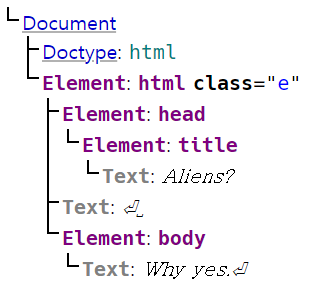

# Shadow Dom

문서 객체 모델(The Document Object Model, DOM)은 원래 문서(HTML 및 XML)에 접근하고 조작하기 위한 API. 즉, 메모리에 웹 페이지 문서 구조를 표현함으로써 스크립트 및 프로그래밍 언어와 페이지를 연결한다. DOM은 각 문서를 논리 트리로 표현한다. 트리의 노드들은 자식을 가질 수도 있고 가지지 않을 수도 있다.

```html
<!DOCTYPE html>
<html class="e">
  <head>
    <title>Aliens?</title>
  </head>
  <body>
    Why yes.
  </body>
</html>
```

tree node로 표현된 dom



이러한 노드 트리의 중요한 문제점은 모든 노드들이 global하다는 점이다. 문서의 어느 위치에서든지 `document.querySelector()`를 통해 문서에 있는 모든 노드에 접근할 수 있다.  
이는 문서의 각기 다른 부분들이 충돌할 수 있는 가능성을 야기시킨다.  
Shadow Dom은 이를 해결하는 방법이 될 수 있다.

**Shadow DOM은 Firefox (63 이상), Chrome, Opera, Safari에서 기본으로 지원. 새로운 Chromium 기반의 Edge (79 이상) 또한 Shadow DOM을 지원하나 구버전 Edge는 지원하지 않음.**

## `<iframe>`

`<iframe>`은 웹 페이지에 다른 웹 페이지를 삽입하는 요소이다. ``태그처럼 현재 웹 문서에 다른 웹 문서를 삽입할 수 있게 한다. 직접 조작할 수 없거나 자체적인 버전을 구현하고 싶지 않은 외부 컨텐츠를 웹 사이트에 포함할 수 있게 해준다. youtube 동영상이나 google map을 넣는 등에 사용할 수 있음.

## Shadow Dom

하지만 `<iframe>`을 사용하는 경우 다른 웹 페이지를 요청하는 방식이기 때문에 http 요청이 일어나고 별도의 페이지이기에 소비되는 리소스가 크고 속도가 느리다. 또한 해당 페이지에서 `<iframe>`으로 웹 페이지를 삽입하지 못하도록(경제적 : 많은 이들이 해당 페이지를 삽입하면 페이지의 요청이 더 많이 일어나기 때문에 더 많은 비용을 지불해야 할 수도 있음, 저작권 문제 : 페이지를 본인의 사이트라고 우길 수 있음, 보안 : 클릭재킹을 통해 데이터를 빼낼 수 있음) 할 수도 있다.

이러한 이유들로 인해 트위터(현 X)에서 `<iframe>`을 shadow dom으로 전환하기도 했다.

간단히 말하면 웹 페이지에 이와 구분되는 웹 페이지를 삽입하는 기술이라 생각하면 된다.


shadow dom은 숨겨진 dom 트리가 통상의 dom 트리에 속한 요소에 부착될 수 있도록 한다.

- **Shadow host**: shadow DOM이 부착되는 통상적인 DOM 노드.
- **Shadow tree**: shadow DOM 내부의 DOM 트리.
- **Shadow boundary**: shadow DOM이 끝나고, 통상적인 DOM이 시작되는 장소.
- **Shadow root**: shadow 트리의 root 노드.

통상의 dom에서 shadow dom 내부의 요소에 접근을 가능하게 할 수도, 불가능하게 할 수도 있다.

```javascript
let shadow = elementRef.attachShadow({ mode: "open" }); // 접근 가능
let shadow = elementRef.attachShadow({ mode: "closed" }); // 접근 불가능, let myShadowDom = myCustomElem.shadowRoot; 를 통해 접근하면 null을 반환
```
