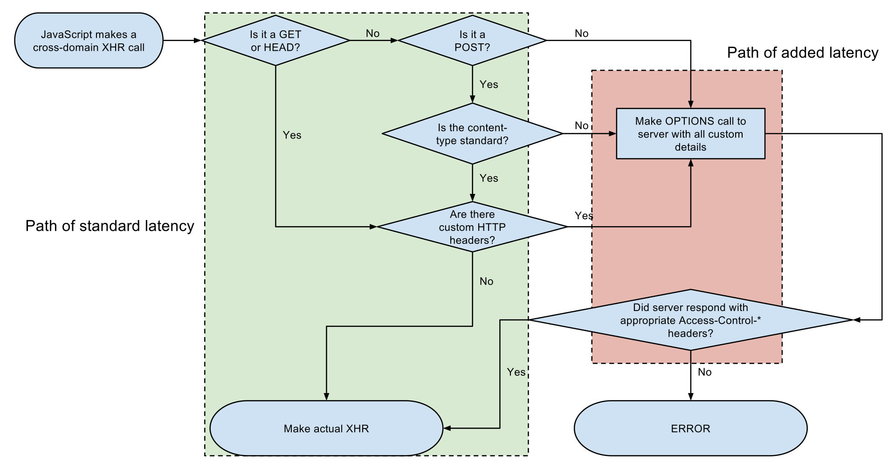

# CORS

[교차 출처 리소스 공유 (CORS) - HTTP | MDN](https://developer.mozilla.org/ko/docs/Web/HTTP/CORS)

**교차 출처 리소스 공유**(Cross-Origin Resource Sharing, CORS)는 추가 HTTP 헤더를 사용해서 한 출처에서 실행중인 웹 어플리케이션이 다른 출처의 자원에 접근할 수 있는 권한을 부여하도록 브라우저에 알려주는 체제.

자신과 출처가 다른 리소스를 필요로 할 때 교차출처 HTTP 요청을 실행한다

웹 브라우저에서 해당 정보를 읽는 것이 허용된 출처를 서버에 설명할 수 있는 새로운 HTTP헤더를 추가해야 한다.

추가적으로, 서버 데이터에 부수효과를 일으킬 수 있는 HTTP요청 메서드(GET을 제외한 HTTP 메서드)의 경우 브라우저가 OPTIONS 메서드로 '프리플라이트'(preflight, 사전전달)하여 지원하는 메서드를 요청하고 서버의 '허가'가 떨어지면 실제 요청을 보낸다.

CORS에러의 경우 보안상의 이유로 JavaScript에서는 오류의 상세 정보에 접근할 수 없다.(!!!)

CORS의 동작 원리

그림을 보면 녹색 부분은 CORS preflight를 발생시키지 않는 일부 요청이다.

- 다음 중하나의 메서드

  - GET

  - HEAD

  - POST

- 유저가 직접 설정한 헤더가 **Fetch 명세에서 “CORS-safelisted request-header”로 정의한 헤더** 만 있다

  - `Accept`

  - `Accept-Language`

  - `Content-Language`

  - `Content-Type`

- `Content-Type`헤더는 다음의 값들만 허용

  - `application/x-www-form-urlencoded`
  - `multipart/form-data`
  - `text/plain`

- 요청에 사용된 `XMLHttpRequestUpload` 객체에 이벤트 리스너가 등록되어 있지 않다. 이들은 `XMLHttpRequest.upload` 프로퍼티를 사용하여 접근

- 요청에 [`ReadableStream`](https://developer.mozilla.org/ko/docs/Web/API/ReadableStream) 객체가 사용되지 않는다
