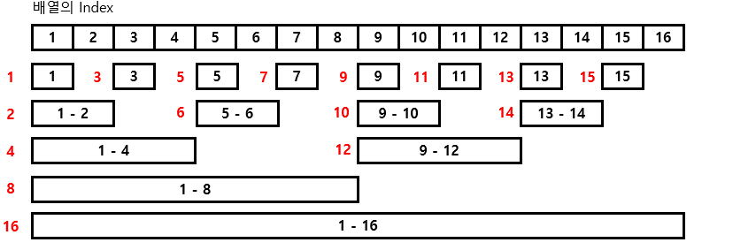
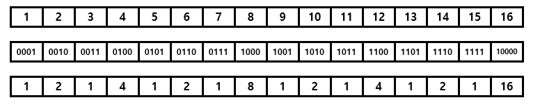
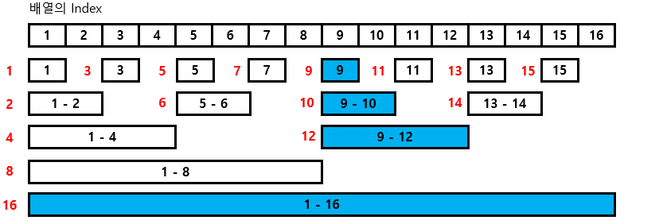
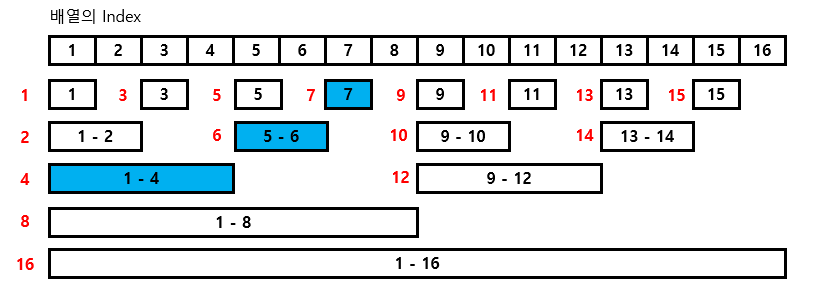
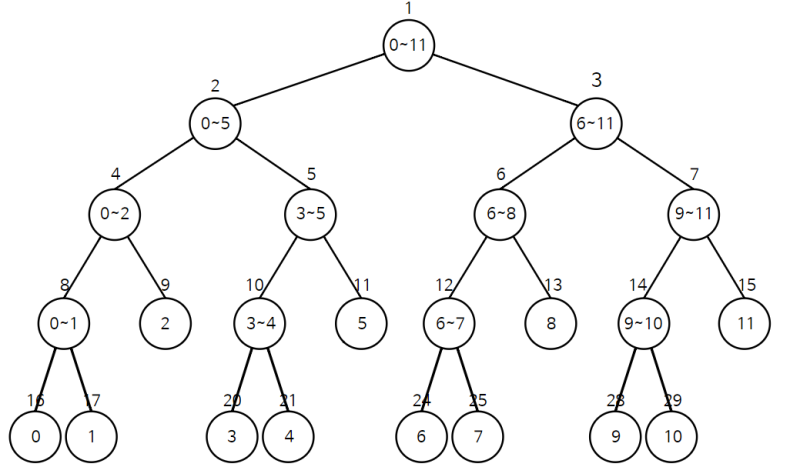

# 펜윅트리

1번 index부터 i번 index까지의 구간합을 미리 구해놓고 이를 이용해 구간합을 구하는 방식. [i, j]까지의 구간합을 구한다면 `[1, j]의 구간합 - [1, i-1]의 구간합`를 통해 구할 수 있다.

수의 변경이 빈번하게 일어날 때 유용하게 사용할 수 있다.

수의 변경이 잦은 구간합 풀이의 다른 방식인 세그먼트 트리는 공간복잡도가 편의상 4n(노드 수 \* 4)로 계산한다. 수가 많아질수록 공간복잡도가 많이 커진다. 펜윅트리는 공간복잡도가 n(노드의 수)이기 때문에 세그먼트 트리에 비해 공간복잡도 면에서 우수하고 구현하기가 쉽다.

펜윅트리는 이진법을 이용해서 일부 구간의 구간합을 미리 구해놓는다.





1번의 경우 [1, 1]의 구간합
2번의 경우 [1, 2]의 구간합
3번의 경우 [3, 3]의 구간합
4번의 경우 [1, 4]의 구간합
...
12번의 경우 [9, 12]의 구간합
위와 같이 계산되어 있는 리스트를 활용한다.



9번 노드의 수에 변화가 있을 때, 계산되어 있는 구간합을 변화시켜야 한다. 이 때 영향을 받는 구간은 위와 같다.



7번까지의 구간합을 구하기 위해서는 [1, 4], [5, 6], [7, 7]의 구간합을 더해주면 된다.

## 구현

### 값 변화

```python
a = [1, 2, 3, 4, 5, 6, 7]
tree = [0, 0, 0, 0, 0, 0, 0]
for i in range(7):
    number = a[i]
    i += i
    while i <= 7:
        tree[i] += number
        i += i & -i
```

위와 같이 구간합을 구할 수 있다. 마찬가지로 노드의 값에 변화가 있을 때

```python
while idx <= n:
    tree[idx] += change
    idx += idx & -idx
```

로 미리 값을 변화시켜 놓을 수 있다.

### 구간합 구하기

```python
idx = 7
answer = 0
while idx > 0:
    answer += tree[idx]
    idx -= idx & -idx
```

위와 같이 미리 구해져 있는 구간합을 더해서 [1, i]의 구간합을 구할 수 있다.

## lazy propagation

펜윅트리의 경우 구간합을 구하거나 하나의 값에 변화가 있을 때 `log(n)`만큼의 시간이 걸린다.

이는 [i, j]에 변화가 생겼을 때 `mlog(n)`의 시간이 걸린다는 뜻이고 이처럼 구간의 변화가 잦은 경우 시간이 오래 걸릴 수 있다. 이를 해결하는 방법이 세그먼트 트리의 경우 `lazy propagation` 알고리즘이 있는데 펜윅트리로도 이를 비슷하게 구현할 수 있다.

```python
'''
[2, 4]에 6을 더한다.
[2, 4] : +6
idx  1  2  3  4  5
'''
a = [1, 4, 7, 9, 5]
b = [0, 6, 6, 6, 0]
'''
a리스트의 변화량인 b[i]
b[i]는 다음의 c리스트의 [1, i]구간합으로 나타낼 수 있다.
'''
c = [0, 6, 0, 0, -6]

'''
위의 방식은 a[i]의 변화만을 구할 수 있다.
a[1, i]의 변화는 d[i]와 같다.
'''
d = [0, 6, 12, 18, 18]
# [2, 4] : +6
# [a, b] : +6
d = [0, 1*6, 2*6, 3*6, 3*6]
d = [0, (idx-2+1)*6, (idx-2+1)*6, (idx-2+1)*6, (4-2+1)*6]
d_idx_relation = [0, idx*6, idx*6, idx*6, 0]
d  = [0, (-2+1)*6, (-2+1)*6, (-2+1)*6, (4-2+1)*6]

d_idx_relation = [0, 6, 0, 0, -6] # 이 값에 idx를 곱함
d = [0, (-a+1)*6, 0, 0, b*6] # 이 트리의 [1, i]의 합을 더함
```

[1, i]의 구간의 변화를 index를 통해 미리 구하여 [1, i]의 구간합에 변화값을 더한다.

방금 풀고서도 이해하고 설명하기 어렵다. 이후 필요할 때마다 다시 보고 공부해야 할 것 같다.

[참고](https://nahwasa.com/entry/%ED%8E%9C%EC%9C%85-%ED%8A%B8%EB%A6%ACFenwick-tree-BIT-%EA%B8%B0%EB%B3%B8-2D-lazy-propagationrange-update-point-query-range-update-range-query#%EC%9D%91%EC%9A%A9_3_:_%EA%B5%AC%EA%B0%84_%EC%97%85%EB%8D%B0%EC%9D%B4%ED%8A%B8,_%EA%B5%AC%EA%B0%84_%EA%B0%92_%ED%9A%8D%EB%93%9D)

[구간 합 구하기 2](https://www.acmicpc.net/problem/10999)

```python
import sys
input = sys.stdin.readline
n, m, k = map(int, input().split())
tree = [0] * (n+1)
for i in range(1, n+1):
    num = int(input())
    while i <= n:
        tree[i] += num
        i += i & -i
idx_change = [0] * (n+1)
change = [0] * (n+1)
for _ in range(m+k):
    a, b, c, *d = map(int, input().split())
    if a == 1:
        d = d[0]
        idx = b
        while idx <= n:
            idx_change[idx] += d
            change[idx] += d * (-b+1)
            idx += idx & -idx
        idx = c + 1
        while idx <= n:
            idx_change[idx] -= d
            change[idx] -= d * (-c)
            idx += idx & -idx
    else:
        answer = 0
        mul = 0
        idx = c
        while idx > 0:
            mul += idx_change[idx]
            answer += tree[idx] + change[idx]
            idx -= idx & -idx
        answer += c * mul
        mul = 0
        idx = b - 1
        while idx > 0:
            mul += idx_change[idx]
            answer -= tree[idx] + change[idx]
            idx -= idx & -idx
        answer -= mul * (b-1)
        print(answer)
```

# 세그먼트 트리

i부터 j까지의 구간합을 미리 구해놓고 이를 이용해 구간합을 구하는 방식. 이를 응용하면 i부터 j까지의 최댓값이나 최솟값도 미리 구해놓고 사용할 수 있다.



루트 트리의 인덱스 1 -> tree의 index  
리프 트리의 인덱스 16, 17 -> tree의 index

루트 트리의 0~11 -> arr의 0~11의 합  
리프 트리의 0, 1 -> arr의 0, 1

```python

# 최초 값으로 세그먼트 트리 생성
# index : tree의 index
# start, end : start부터 end까지의 합
# start부터 end까지의 합을 tree[index]에 저장한다
def init(start, end, index):
    if start == end:
        tree[index] = arr[start]
        return tree[index]
    mid = (start + end) // 2
    # tree의 index를 채울때, 재귀로 아래쪽의 두 노드를 찾음
    # index * 2 => 해당 노드의 왼쪽 아래 노드
    # index * 2 + 1 => 해당 노드의 오른쪽 아래 노드
    tree[index] = init(start, mid, index * 2) + init(mid + 1, end, index * 2 + 1)
    return tree[index]


# left부터 right까지의 합을 구하는 함수
def find_sum(start, end, index, left, right):
    # left나 right가 arr의 범위를 벗어난다.
    if left > end or right < start:
        return 0
    # 범위 안에 있다면 left부터 right까지의 합이 tree[index]이다
    if left <= start and right >= end:
        return tree[index]
    # 그렇지 않다면 두 부분으로 나누어 합을 구한다
    mid = (start + end) // 2
    # tree[index * 2] 노드에 대한 탐색 : 현재 노드의 왼쪽 아래 노드가 left와 right 사이의 arr값들의 합인가?
    # tree[index * 2 + 1] 노드에 대한 탐색 : 현재 노드의 오른쪽 아래 노드가 left와 right 사이의 arr값들의 합인가?
    return find_sum(start, mid, index * 2, left, right) + find_sum(mid + 1, end, index * 2 + 1, left, right)


# what : 값을 변화시키려 하는 arr의 인덱스
# value : 변화량(변화된 값 - 현재 값)
def update(start, end, index, what, value):
    if what < start or what > end:
        return
    # 범위 안에 있다면 값 변경
    tree[index] += value
    # 현재 tree의 노드가 나타내는 값이 arr[what]이라면 더이상 갱신 필요x
    if start == end:
        return
    mid = (start + end) // 2
    # 왼쪽 아래 노드(tree[index * 2])를 갱신하러 감
    update(start, mid, index * 2, what, value)
    # 오른쪽 아래 노드(tree[index * 2 + 1])를 갱신하러 감
    update(mid + 1, end, index * 2 + 1, what, value)

arr = [5, 1, 3, 8, 4, 7]
# len(arr)이 n일때, n보다 큰 가장 작은 제곱수의 2배만큼의 크기가 필요하지만 이를 정확히 구하기 힘들기 때문에 대충 n * 4의 크기로 tree를 생성한다
tree = [0] * (len(arr) * 4)

# index = 1인 이유는 tree[1]이 루트 노드이기 때문에
init(0, len(arr) - 1, 1)

```
