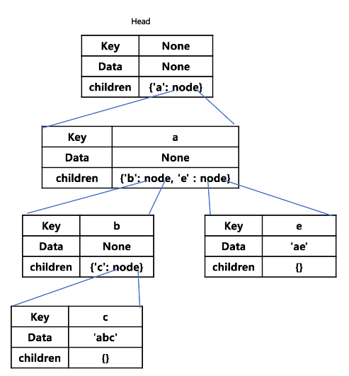

# deque

파이썬에서 쓰이는 자료형.

double ended queue의 줄임말로 리스트와 비슷하지만 양 끝에서의 접근에 최적화된 자료구조이다. 양 끝에서 pop(), append()를 O(1)의 성능으로 지원한다.

Linked-list로 이를 구현하며 linked-list는 index접근이 불가능하지만 파이썬에서 제공하는 deque에서는 index접근이 가능하다. 이는 양 끝에서 연결된 index로 차례로 접근해 나가는 방식으로 구현되어 있으며 list에서 index접근을 할 경우 O(1)의 성능이지만 deque에서 index접근을 하게 될 경우 최악의 경우 O(n)이 걸리게 된다. 또한 고정길이 연산에 최적화 되어 있으며 길이를 지정했을 경우에 초과하는 길이를 추가하게 되면 오래된 순서대로 내용을 삭제하게 된다.

# map

key - value 로 연결되는 쌍들을 저장하는 자료구조.

index가 존재하지 않는다.

Java의 경우 hash map, tree map, linked hash map으로 구현되어 있다. tree map은 정렬이 되는 map, linked hash map은 순서가 보장되는 map이다.

map을 구현하기 위해서는 hash함수가 사용된다. hash 함수란, 임의의 길이의 데이터를 고정된 길이의 데이터로 매핑하는 함수이다. 이렇게 만들어진 고정된 길이의 데이터를 주소값과 연결하여 해당 위치에 value를 저장하는 방식으로 map을 구현한다. 저장되는 위치를 버킷(bucket)이라 부른다.

이 때, key의 값이 달라도 hash된 결과값이 같은 경우도 존재할 수 있는데(충돌) 이러한 경우를 처리하는 방식은 크게 2가지가 있다.

#### open addressing

- linear probing
  
  - 해당 버킷이 사용중이면 바로 다음 인덱스에 저장하는 방식.

- quadratic probing
  
  - 해당 버킷이 사용중이면 i^2씩 이동

이런 방식의 경우 데이터의 삭제가 빈번하게 일어나게 된다면 자료의 처리가 불편해지게 되고 데이터의 양이 매우 많아지게 될 경우 느려진다.

#### chaining

충돌이 일어날 경우 같은 hash값을 가지는 데이터들을 linked list 형태로 연결.

Java의 경우 해당 버킷의 길이가 너무 커지게 될 경우 tree로 변경될 수도 있다.

# set

집합. map과 마찬가지로 hash함수를 사용하여 구현한다. map과 마찬가지 이지만 key - value 쌍의 데이터인 map과는 달리 value가 빈 데이터를 저장한다 생각하면 쉽게 이해가 된다.

# Trie

트라이 자료구조. 문자열 검색에 자주 사용됨. 자동 완성이나 검색어 추천 등에 사용됨.

`O(n)`의 속도로 문자열을 검색할 수 있음. 메모리가 많이 사용될 수 있음.



### 기본적인 구현

```python
# object를 상속받음
class Node(object):
    # key는 현재의 데이터 값, 현재 노드가 나타내는 알파벳
    # data는 현재 알파벳으로 끝나는 단어
    # children(dict)은 이어지는 알파벳을 담음 ex) {'a': Node('a'), 'b' : Node('b')}
    def __init__(self, key, data=None):
        self.key = key
        self.data = data
        self.children = {}

class Trie():
    # 트라이가 생성될 때, 현재 노드가 나타내는 알파벳이 없는, 빈 node를 생성함.
    def __init__(self):
        self.head = Node(None)

    # 단어 word를 Trie에 넣음
    def insert(self, word):
          current = self.head
          # 각각의 알파벳을 현재 노드의 하위노드에서 찾음
          for char in word:
              # 하위 노드에 해당 알파벳이 없다면 노드를 생성함
              if char not in current.children:
                  current.children[char] = Node(char)
              # 찾은 하위 노드로 이동함
              current = current.children[char]
          # 최종 하위 노드에 data, 현재 알페벳으로 끝나는 단어를 입력함
          current.data = word

    # 단어를 찾음
    def search(self, word):
          current = self.head
          # 각각의 알파벳을 현재 노드의 하위 노드에서 찾음
          for char in word:
              # 하위 노드에 해당 알파벳이 없다면 해당 단어가 없다는 것임. 거짓 반환
              if char not in current.children:
                  return False
              # 해당 하위 노드로 이동
              current = current.children[char]
          # 마지막 노드의 data에 word가 들어있다면 해당 단어가 있는 것임. 진실 반환
          if current.data == word:
              return True
          # 노드는 존재하지만 단어는 없을 수 있음. 거짓 반환
          else:
              return False
```

여기에 필요 여부에 따라 `key`나 `data`를 없애거나 필요한 정보를 추가하는 식으로 변형할 수 있음.
