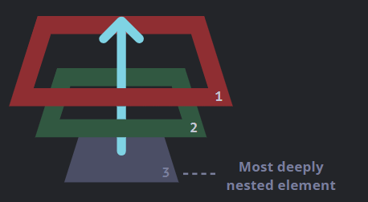
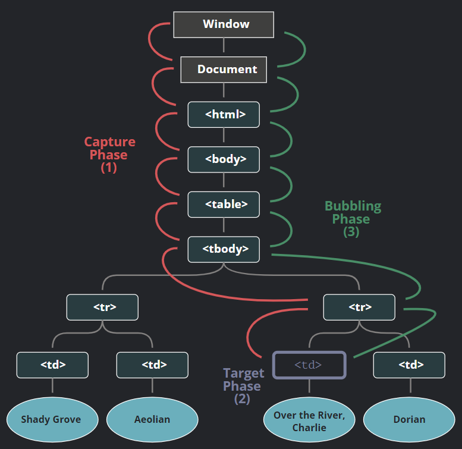

## 이벤트 버블링

요소에 이벤트 핸들러를 할당했을때, 해당 요소의 하위 요소에 이벤트가 발생하더라도 그 상위 요소에 할당되어 있는 이벤트 핸들러가 작동한다. 하위 요소에 발생한 이벤트가 상위 요소에 전파되어 상위 요소의 이벤트 핸들러를 작동시킨 것이다. 이처럼 하위 요소에 발생한 이벤트가 상위 요소로 전파되는 것을 이벤트 버블링이라 한다.



#### 이벤트 대상

이벤트가 상위 요소로 전달되더라도 해당 이벤트가 어디서 발생했는지를 알 수 있다.`event.target`

#### 버블링 중지

이벤트는 상위 요소로 계속해서 전파되어 `<html>` 다음 `document`로 이동하고 일부 이벤트의 경우는 `window`까지 전파된다. 이를 막기 위해 `event.stopPropagation()`을 사용할 수 있다.

이때, 주의할 점이 있는데 버블링 중단을 사용하게 되면 해당 요소 하위에서 어떤 이벤트가 발생하는지 상위의 요소는 알 수 없게 된다. 예를 들어, 사용자 행동을 추적하기 위해 전체 창에서 어느 부분을 사용자들이 클릭하는지 포착하기로 하였다면 이벤트 중단이 되어있는 부분의 하위 요소에는 클릭이 전혀 발생하지 않는다고 분석이 될 수 있다. 때문에 버블링 중단은 신중하게 사용해야 하고, 다른 방식으로 이를 해결하도록 해야한다.

## 이벤트 캡쳐

이벤트 처리 단계에는 캡쳐라는 단계도 존재한다.

이벤트 흐름에는 3단계가 존재한다.

1. 캡처링 단계 - 이벤트가 하위 요소로 전파되는 단계

2. 타깃 단계 - 이벤트가 실제 타깃 요소(event.target)에 전파되는 단계

3. 버블링 단계 - 이벤트가 상위 요소로 전파되는 단계



단, 캡처링 단계에서 이벤트를 잡아내기 위해서는 `addEventListener`의 `capture` 옵션을 `true`로 설정해야 한다.

```html
<style>
  body * {
    margin: 10px;
    border: 1px solid blue;
  }
</style>

<form>
  FORM
  <div>
    DIV
    <p>P</p>
  </div>
</form>

<script>
  for (let elem of document.querySelectorAll("*")) {
    elem.addEventListener(
      "click",
      (e) => alert(`캡쳐링: ${elem.tagName}`),
      true
    );
    elem.addEventListener("click", (e) => alert(`버블링: ${elem.tagName}`));
  }
</script>
```

위와 같은 html을 실행하여 `<p>` 태그를 클릭하게 되면

`캡쳐링: HTML` -> `캡쳐링: BODY` -> `캡쳐링: FORM` -> `캡쳐링: DIV` -> `캡쳐링: P` -> `버블링: P` -> `버블링: DIV` -> `버블링: FORM` -> `버블링: BODY` -> `버블링: HTML` 의 순서로 alert 창이 뜬다.

## 이벤트 위임

캡처링과 버블링을 이용한 강력한 이벤트 핸들링 패턴이다. 같은 방식, 혹은 비슷한 방식으로 여러 요소를 다뤄야 할 때 사용할 수 있으며 각각의 요소마다 핸들러를 할당하지 않고 공통 조상에 이벤트 핸들러를 할당해 여러 요소를 한꺼번에 관리하는 방법이다.

테이블 컴포넌트의 한 요소를 클릭했을 때 해당 요소를 강조하거나 해당 요소의 내용을 복사하는 등의 이벤트 핸들러를 등록할 때, 테이블 내부 요소 각각에 핸들러를 할당하지 않고 테이블 컴포넌트에 이벤트 핸들러를 할당하더라도 `event.target`을 사용하면 버블링을 이용해 어떤 요소에서 이벤트가 발생했는지 알 수 있고 이를 활용할 수 있다.

```html
<div id="menu">
  <button data-action="save">저장하기</button>
  <button data-action="load">불러오기</button>
  <button data-action="search">검색하기</button>
</div>

<script>
  class Menu {
    constructor(elem) {
      this._elem = elem;
      elem.onclick = this.onClick.bind(this); // (*)
    }

    save() {
      alert("저장하기");
    }

    load() {
      alert("불러오기");
    }

    search() {
      alert("검색하기");
    }

    onClick(event) {
      let action = event.target.dataset.action;
      if (action) {
        this[action]();
      }
    }
  }

  new Menu(menu);
</script>
```

또 다른 예시이다.

이처럼 이벤트 위임을 사용하면 모든 요소에 핸들러를 할당하는 코드를 작성할 필요가 없게 되고 언제든지 요소를 추가하고 삭제할 수 있게 된다.
