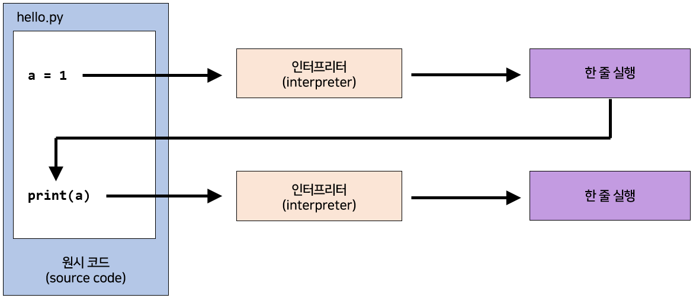

일반적으로 Python에 비해 PyPy가 성능이 더 좋다라고 알고 있었는데 백준에 있는 문제를 풀다가 Python으로는 통과가 되지만 PyPy로는 메모리 초과가 발생하는 문제를 만나서 'PyPy로 안되는데 Python으로 통과가 된다고?'라는 의문점이 생겨 그 차이를 가볍게 알아보았다.

### 컴파일러와 인터프리터

고급 프로그래밍 언어를 어셈블리어로 번역을 하는 방식에는 2가지가 있다

#### 정적 컴파일 방식

컴파일러는 원시코드(source code)를 목적코드(object code)로 바꿔서 실행을 시키는 것으로 목적코드들을 묶어서 하나의 실행파일로 만드는 링킹이라는 과정을 거쳐 하나의 실행파일을 만들고 이를 실행한다. 따라서 실행 전에 오류를 발견할 수 있고 초기 스캔 시간이 걸리지만 전체 실행 시간만 보면 인터프리터보다 빠르고 메모리를 인터프리터보다 많이 사용한다.
C, C++, JAVA

#### 인터프리트 방식

인터프리터는 프로그램을 실행할 때 한 문장씩 번역해서 실행한다. 목적코드나 링킹과정이 필요 없기에 메모리 사용효율 면에서 앞서지만 전체적인 코드의 실행 속도 면에서는 컨파일러에 미치지 못한다. 또한 실행해야지만 오류를 확인할 수 있다.
Python, Ruby, Javascript

#### Python3, PyPy3

이 글에서 Python3는 CPython을 말한다. CPython은 C언어로 구현된 python 구현체(언어를 이해하고 실행하는 역할)이다. python코드를 bytecode로 바꾸고 이 코드를 인터프리터(가상머신)가 실행한다.

하지만 PyPy3의 경우 Python으로 구현된 python 구현체로 JIT(Just-In Time) 컴파일 방식을 사용한다. 이는 인터프리트 방식과 정적 컴파일 방식의 혼합과 같다. 실행 시점에 기계어 코드를 생성해 이를 캐싱하여 같은 함수가 여러번 불릴 때 캐싱한 기계어 코드를 불러와 사용함으로써 같은 기계어 코드를 매번 생성하는 것을 막아 더 빠르게 컴파일하여 실행할 수 있도록 한 방식이다.

기계어 코드를 캐싱하기 때문에 메모리를 훨씬 많이 사용하게 되지만 더 빠르게 실행할 수 있게 된다. 따라서 매우 간단하고 짧은 코드의 경우 단순하게 Python3로 실행하는 것이 메모리, 시간 측면에서 더 빠르다. 하지만 코드가 복잡해질수록 PyPy3가 더 빨라지지만 이 때 메모리 사용의 측면을 잘 고려해야 한다. 일부 함수들의 경우 일반적인 방식보다 더 빠르지만 더 많은 메모리를 사용하고 문제풀이 방식의 설계를 잘못하면 `recursion error`가 발생하기도 한다고 한다.
