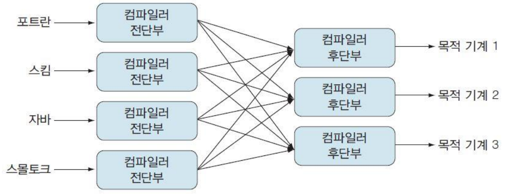
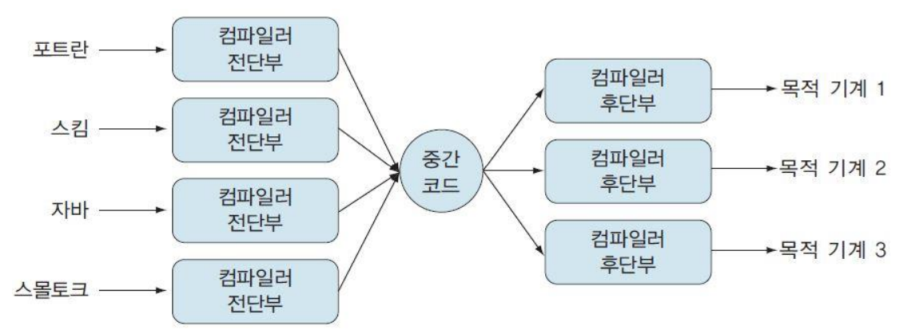

이전 컴파일러와 인터프리터, JVM에 관한 내용을 정리한 적이 있지만 이 내용들이 따로 정리될 내용이 아니라 생각되어 하나의 파일에 정리하려 한다.  
[Python vs PyPy](./프로그래밍/Python_vs_PyPy.md)  
[JVM](./백엔드/자바/JVM.md)

# 중간 코드(Intermediate code)

중간 코드(intermediate code)는 구문 분석 단계에서 만들어진 구문 트리를 이용하여 생성되거나, 한 문법 규칙이 감축될 때마다 구문 지시적 번역으로 생성이 이뤄진다. 중간 코드를 생성하는 데는 중간 언어(intermediate language, IL)를 사용한다.

중간언어를 사용하지 않을 경우 위 그림과 같이 N개의 언어와 M개의 기계가 있을 때 `N * M` 개 만큼의 컴파일러가 필요하다. ex) 포트란-기계1 컴파일러, 포트란-기계2 컴파일러, 자바-기계1 컴파일러, 자바-기계2 컴파일러, ....

중간언어를 사용하게 되면 위와 같이 각 언어를 중간언어로 바꾸어주는 컴파일러, 중간코드를 목적 기계에 맞게 목적코드로 변환하는 컴파일러 두 종류의 컴파일러를 사용해 `N + M`개 만큼의 컴파일러 모듈만 있으면 된다. 또한, 소스코드와 목적 기계의 특성과 관계없는, 특성에 독립적인 이식성 높은 컴파일러를 개발할 수 있다. 기계에 상관없이 최적화를 수행하기 때문에 효율적인 최적화가 가능하다. 또한 인터프리터를 사용해 실행할 수 있다.

# 정적 컴파일 방식

컴파일러는 소스코드를 목적코드(바이너리 코드)로 변환한다. 컴파일러는 컴파일러 전단부 모듈과 후단부 모듈로 나눌 수 있고 전단부에서 중간 코드로 변환하고 후단부에서 이를 목적코드로 변환한다. 생성된 목적 코드를 링킹 과정을 통해 하나의 실행 파일로 만든다. 프로그램 전체를 번역하여 최적화를 수행한 후 하나의 실행 파일을 만들기에 한 번 번역을 하면 전체를 실행하는 속도는 빠르지만 사소한 변화에도 매 번 전체를 컴파일해야 하는 단점이 있다.

# 인터프리트 방식

실행되는 하나의 행마다 번역을 한다. 인터프리터는 소스코드를 중간 코드로 변환하고 이를 실행한다. 때문에 실행을 하며 문제가 있는 코드를 만나야 문제가 발생했다는 것을 알게되고, 그 이후의 코드는 살펴보지 않는다.

# JIT 컴파일, 동적 번역(Just-In-Time compilation, Dynamic translation)

인터프리트 방식은 프로그래밍 코드를 실행 시점에 기계어 코드로 번역해 실행한다. 정적 컴파일 방식은 실행 전에 프로그래밍 코드를 기계어 코드로 번역한다. JIT 컴파일 방식은 실행 시점에 기계어 코드로 번역에 생성된 기계어 코드를 캐싱해 같은 함수가 여러번 불릴 때 매 번 기계어 코드를 생성하는 것을 막을 수 있다. JIT 컴파일 방식은 일반적으로 인터프리트 방식에 비해 실행 속도가 빠른데 이는 캐싱을 통해 얻는 이점이기도 하지만, 중간 코드인 바이트 코드를 JIT하게 되는 경우 바이트 코드를 생성하며 한 번 최적화를 진행하기 때문에 최적화와 캐싱을 모두 활용하기에 얻는 이점이기도 하다. 바이트 코드를 생성하고 이를 JIT로 실행하는 대표적인 언어가 자바이다.

# 자바

자바는 컴파일러와 인터프리터를 모두 사용한다. 최근의 JVM은 JIT를 지원하는데 이에 관해 설명한다면 컴파일러의 역할과 인터프리터의 역할과 JIT에 대해 이해할 수 있을 것이라 생각한다. 자바는 자바 컴파일러를 통해 `.java` 파일을 바이트 코드이자 중간 코드인 `.class` 파일로 번역한다. 이렇게 번역된 바이트 코드를 자바 인터프리터를 통해 한 줄씩 읽어 실행한다. 따라서 자바는 정적 컴파일 방식을 사용하며 동시에 인터프리트 방식을 사용하기도 하는 것이다. 자바를 인터프리트 언어로 구분하기도 하고 정적 컴파일 언어로 구분하기도 하는데 이러한 이유로 인한 것이다. JIT는 바이트 코드 혹은 소스 코드의 한 줄을 번역해 생성된 기계 코드를 캐싱하는 방식이기 때문에 `.class` 파일을 번역해 생성된 기계 코드를 캐싱하는 방식을 통해 JIT 컴파일 방식을 사용하는 것이다.
