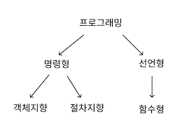

# 프로그래밍 패러다임

간단하게는 어떤 방식으로 프로그램을 만드느냐의 의미

프로그래머에게 프로그래밍의 관점을 갖게 해주는 개발 방법론



## 선언형과 함수형

```js
const ret = [1, 2, 3, 4, 5, 11, 12].reduce(
  (max, num) => (num > max ? num : max),
  0
);
console.log(ret); // 12
```

위와 같이 '순수 함수'들을 쌓아 로직을 구현하고 '고차 함수'를 통해 재사용성을 높인 프로그래밍 패러다임

자바스크립트의 경우 함수가 일급객체이기에 함수형 프로그래밍이 선호됨

##### 순수 함수

출력이 입력에만 의존하는 것

##### 고차 함수

함수가 함수를 값처럼 매개변수로 받아 로직을 생성할 수 있는 것

##### 일급객체

고차함수를 사용하기 위해서는 해당 언어가 일급객체라는 특징을 가져야 한다.

- 변수나 메서드에 함수를 할당할 수 있다.

- 함수 안에 함수를 매개변수로 담을 수 있다.

- 함수가 함수를 반환할 수 있다.

## 객체지향 프로그래밍

객체들의 집합으로 프로그래밍 상호작용을 표현함

데이터를 객체로 취급하여 객체 내부에 선언된 메서드를 활용한다.

설계에 많은 시간이 소요되며 처리 속도가 다른 프로그래밍 패러다임에 비해 상대적으로 느리다.

```js
const ret = [1, 2, 3, 4, 5, 11, 12];
class List {
  constructor(list) {
    this.list = list;
    this.mx = list.reduce((max, num) => (num > max ? num : max), 0);
  }
  getMax() {
    return this.mx;
  }
}
const a = new List(ret);
console.log(a.getMax()); // 12
```

위와 같이 List라는 클래스를 생성하고 최댓값을 반환하는 메서드를 생성하여 a객체의 최댓값을 출력한다.

### 특징

객체지향 프로그래밍의 특징은 추상화, 상속성, 캡슐화, 다형성이 있다

#### 추상화

복잡한 시스템으로부터 핵심적인 개념이나 기능을 간추려내는 것

예를 들면, 군인, 장교, 키180, 안경씀, 축구 못함, 게임 잘함 등의 특징을 가진 사람을 코드로 나타낼 때, 군인, 장교만 뽑아 간추려서 나타내는 것

#### 캡슐화

객체의 속성과 메서드를 하나로 묶고 일부를 외부에 감추어 은닉하는 것

#### 상속성

상위 클래스의 특성을 하위 클래스가 이어받아 재사용하거나 추가, 확장하는 것

코드의 재사용, 계층적인 관계 생성, 유지 보수성의 측면에서 중요

#### 다형성

하나의 메서드나 클래스가 다양한 방법으로 동작하는 것. 대표적으로 오버로딩과 오버라이딩

##### 오버로딩

같은 이름을 가진 메서드를 여러 개 두는 것. 메서드의 타입, 매개변수의 유형, 개수 등으로 여러 개를 둘 수 있으며 컴파일 중에 발생하는 정적 다형성이다.

```java
class Person {

  public void eat(String a) {
    System.out.println("I eat"  + a);
  }

  public void eat(String a, String b) {
    System.out.println("I eat " + a + " and " + b);
  }
}

public class CalculateArea {
  public static void main(String [] args) {
    Person a = new Person();
    a.eat('apple')
    a.eat('banana', 'tomato')
  }
}
/*
I eat apple
I eat banana and tomato
*/
```

##### 오버라이딩

주로 메서드 오버라이딩을 말한다. 상위클래스에서 상속받은 메서드를 하위클래스가 재정의 하는 것을 의미. 런타임중 발생하는 동적 다형성이다

(이거 우리 상위클래스에서는 왈왈로 울게 했는데 상속받은 클래스에서 피카피카로 울게 했더니 피카피카하고 울었던 그거)

### 설계원칙

객체지향 프로그래밍은 **SOLID** 원칙을 지켜야한다

- S(SRP, Single Responsiblity Principle) : 단일 책임원칙

  - 모든 클래스는하나의 책임만 가져야 한다

  - a의 로직이 있다면 어떠한 클래스는 a에 관한 클래스여야 하고 이를 수정하면 a와 관련된 수정이어야만 한다

- O(OCP, Open Closed Principle) : 개방-폐쇄 원칙

  - 유지 보수 사항이 생기면 코드를 쉽게 확장할 수 있도록 하고 수정할 떄는 닫혀있어야 한다

  - 기존의 코드는 잘 변경하지 않으면서 확장은 쉬워야 한다

- L(LSP, Liskov Substitution Principle) : 리스코프 치환 원칙

  - 프로그램의 객체는 프로그램의 정확성을 깨지 않으면서 하위 타입의 인스턴스로 바꿀 수 있어야 한다

  - 부모객체에 자식객체를 넣어도 시스템이 문제없이 돌아가야 한다

- I(ISP, Interface Segregation Principle) : 인터페이스 분리 원칙

  - 하나의 일반적인 인터페이스보다 구체적인 여러개의 인터페이스를 만들어야 한다

- D(DIP, Dependency Inversion Principle) : 의존 역전 원칙

  - 자신보다 변하기 쉬운것에 의존하던 것을 추상화된 인터페이스나 상위 클래스에 두어 변하기 쉬운 것의 변화에 영향받지 않게 하는 원칙

  - 상위 계층은 하위 계층의 변화에 대한 구현으로부터 독립해야 한다

## 절차형 프로그래밍

로직이 수행되어야할 연속적인 계산과정으로 이루어져 있다

일이 진행되는 방식 그대로 그저 코드를 구현

가독성이 좋고 실행속도가 빠르지만

모듈화가 어렵고 유지 보수성이 떨어진다

```js
const ret = [1, 2, 3, 4, 5, 11, 12];
let a = 0;
for (let i = 0; i < ret.length; i++) {
  a = Math.max(ret[i], a);
}
console.log(a);
```
