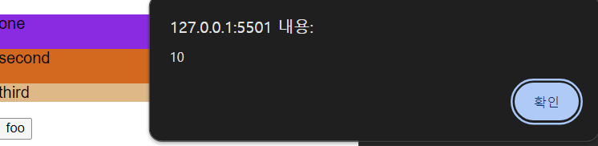
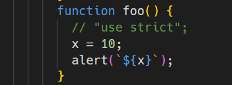
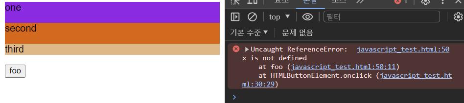
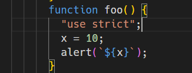

# strict mode

자바스크립트의 경우 에러가 발생할 것 같은 많은 상황에 에러를 발생시키지 않는다.

예)

```javascript
function foo() {
  x = 10;
}

console.log(x);
```

foo 함수 내에 선언된 적이 없는 변수 x에 10을 할당했다. 먼저 자바스크립트 엔진은 foo 함수 스코프에서 변수 x를 찾는다. 찾지 못했기 때문에 foo함수 스코프의 상위 스코프, 예시에서는 전역 스코프에서 변수 x를 찾는다. 찾지 못했기 때문에 전역 객체에 프로퍼티 x를 생성한다. 따라서 전역 변수 x가 생성되고 출력이 된다.

이는 개발자의 의도와는 상관없이 자바스크립트 엔진이 생성한 **암묵적 전역 변수(implicit global)** 이라 한다. 이는 오류를 발생시킬 원인이 될 가능성이 크기 때문에 이러한 상황을 최대한 배제해야 한다. 하지만 누구나 실수는 할 수 있기 때문에 이러한 오류를 발생시키기 어려운 개발환경을 만들고 그 개발환경에서 개발을 하는 것이 근본적인 해결책이 될 수 있다.

이를 위해 ES5부터 **strict mode** 가 추가 되었다.

strict mode를 사용하기 위해서는 전역 혹은 함수의 몸체 선두에 `'use strcit';`를 추가하면 된다.

```js
"use strict";
function foo() {
  x = 10;
}
```

또는

```js
function foo() {
  "use strict";
  x = 10;
}
```

아래와 같은 코드는 제대로 에러를 발생시키지 않기 때문에 선두에 적어야 한다.

```js
function foo() {
  x = 10;
  ("use strict");
}
```

전역에 strict mode를 적용시키면 외부 라이브러리를 사용할 때, 라이브러리가 non-strict mode일 경우 문제가 발생할 수 있기 때문에 전역에 strict mode를 적용시키는 것은 피해야 한다.

함수 단위로 strict mode를 적용시키는 것도 코드의 일관성을 해치기도 하고, strict mode가 적용된 함수가 참조할 함수 외부가 non-strict mode인 것 또한 문제가 발생할 수 있다.

따라서 strict mode는 아래와 같이 즉시실행함수로 감싼 스크립트 단위로 적용하는 것이 바람직하다.

```js
(function () {
  "use strict";
  // 아래에 스크립트 작성
})();
```

strict mode가 적용되지 않은 모습. console 창에도 에러 메세지가 발생하지 않는다.



strict mode가 적용된 모습. 콘솔창에 에러가 발생하며 `alert()`가 실행되지 않았다.


